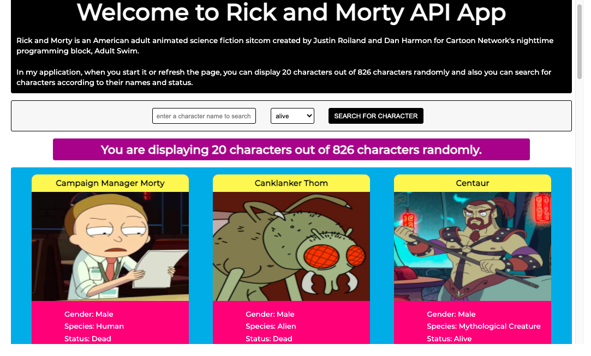

<h1 align="center" id="top">✨ Rick and Morty API App as a Single Page Application ✨</h1>

## ✨ 1. Demo

Online Deployment of this project is available at [Rick and Morty API App](https://caglar-kaya.github.io/api-cartoon-project/)

<p>
  <a href="https://caglar-kaya.github.io/api-cartoon-project/" target="_blank">
    
  </a>
</p>

[](#top)

## ✨ 2. Description

Rick and Morty is an American adult animated science fiction sitcom created by Justin Roiland and Dan Harmon for Cartoon Network's nighttime programming block, Adult Swim.

In my application, when you start it or refresh the page, you can display 20 characters out of 826 characters randomly and also you can search for characters according to their names and status.

[](#top)

## ✨ 3. Directory Layout and Tree

```
.
├── README.md
├── index.html
├── public
│   ├── images
│   │   └── app-demo.png
│   └── style.css
└── src
    ├── app.js
    ├── constants.js
    ├── handlers
    │   └── clickSearchButton.js
    ├── helpers
    │   ├── fetchData.js
    │   └── generateRandomNumber.js
    ├── init
    │   └── initializeApp.js
    ├── utils
    │   └── DOMUtils.js
    └── views
        ├── createCardElement.js
        ├── createHeaderSection.js
        ├── createInfoElement.js
        ├── createSearchMenu.js
        └── createSearchResultAsCard.js
```

[](#top)

## ✨ 4. Application

- Arrow Functions
- Template Literals
- Block-Scoped Variables Let and Const
- async await with try/catch
- Modules export/import

These projects created using: <br> 
 
 
 

[](#top)

## ✨ 5. Creator

👨‍💻 [Caglar Kaya](https://github.com/caglar-kaya)

[ ](https://www.linkedin.com/in/caglar-kaya/)
&nbsp;
[](https://caglar-kaya.slack.com)

[](#top)

## 🤝 6. Contributing

Feel free for your contributions, issues and feature requests <br>
You can check [issues page](https://github.com/caglar-kaya/api-cartoon-project/issues), [pull requests](https://github.com/caglar-kaya/api-cartoon-project/pulls).

[](#top)

## 💝 7. Supporting me

Give a ⭐️ if you liked my projects!

[](#top)

## 📝 8. License

Copyright © 2021 [Caglar Kaya](https://github.com/caglar-kaya).
